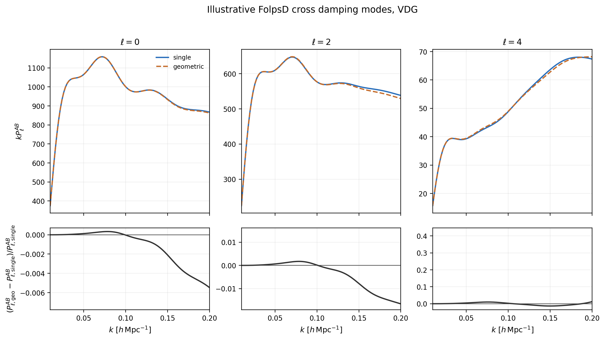
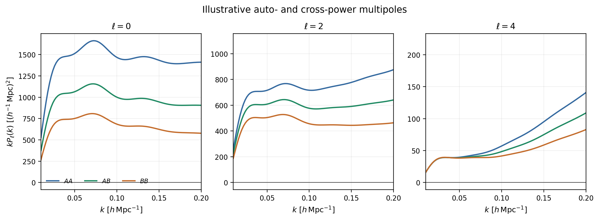
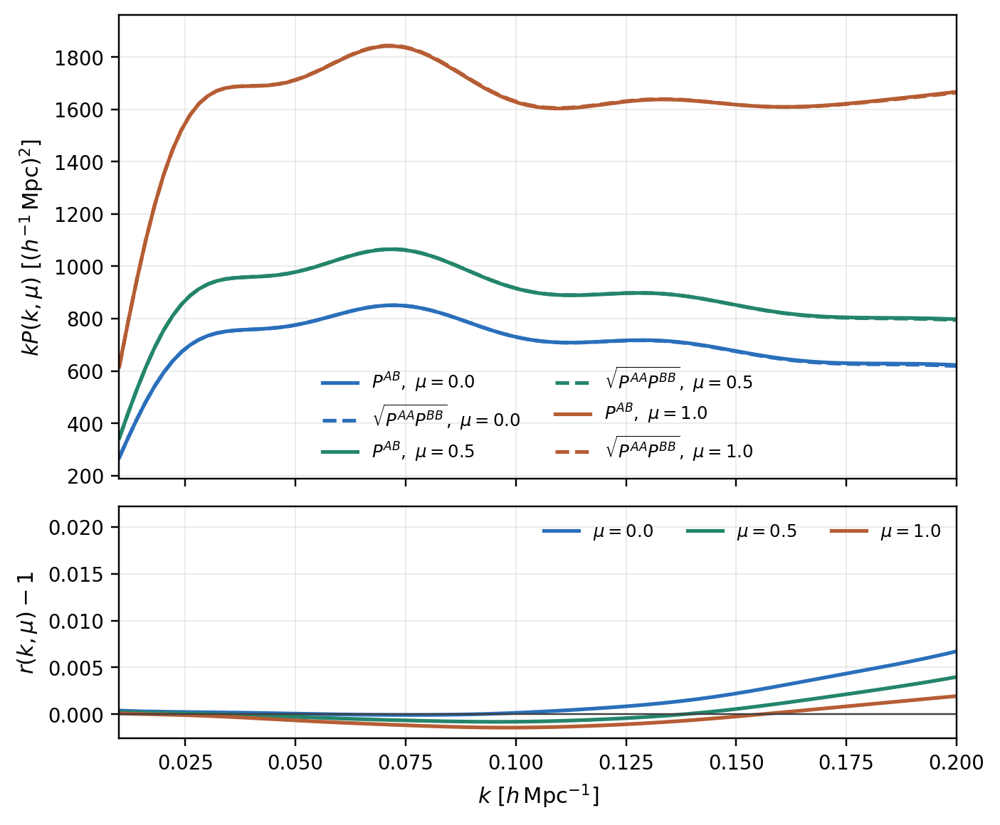
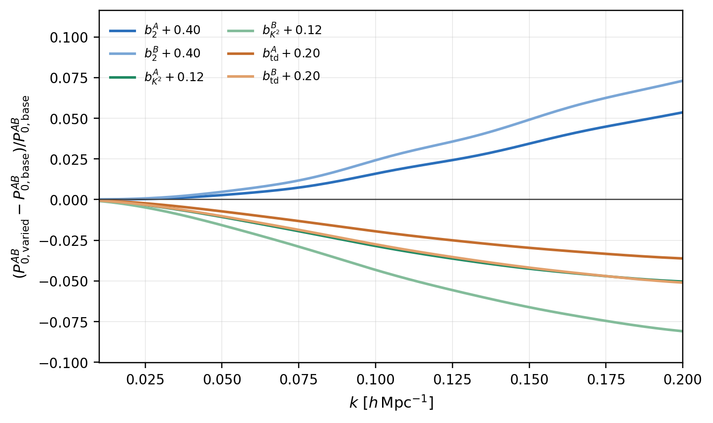
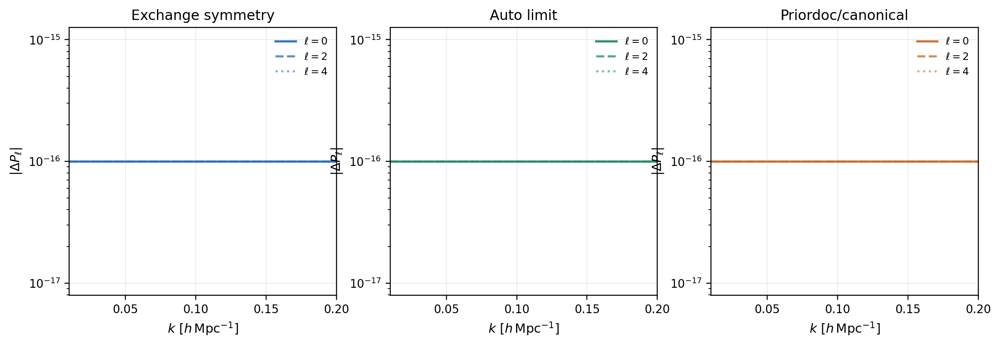

# FOLPS Two-Tracer Cross-Power Technical Reference

This document is the consolidated technical reference for the equal-time two-tracer redshift-space power spectrum implemented in FOLPS. It is written for collaborators, code reviewers, future developers, and AI assistants that need a single source of truth without walking through the chronological audit history. The archived files remain useful provenance, but this document is the current public technical guide.

## 1. Scope and assumptions

The implementation models the equal-time redshift-space power-spectrum cross-correlation of two biased tracers, denoted \(A\) and \(B\). The motivating physical case is an overlapping tracer pair such as LRG3 x ELG1 in a common redshift interval. In that setting the two samples probe the same long-wavelength matter and velocity fields, while their bias expansions, stochastic fields, EFT counterterms, and phenomenological damping parameters can differ.

The goal is not to replace the two auto spectra by a diagnostic approximation. The deterministic linear relation \(P^{AB}=\sqrt{P^{AA}P^{BB}}\) holds only when both tracers are linear, deterministic transforms of the same density field and when all stochastic and nonlinear terms are absent. At one loop, the cross spectrum contains endpoint-bilinear monomials such as \(b_2^A b_1^B+b_1^A b_2^B\), pair-level counterterms, and a renormalized cross-stochastic contribution. A direct cross-power calculation is therefore required.

The implementation assumes:

- equal time;
- one common effective redshift for the pair;
- a common plane-parallel line of sight;
- common matter and velocity fields;
- no tracer velocity bias;
- even multipoles only, usually \(\ell=0,2,4\);
- power spectrum only;
- no wide-angle corrections;
- no relativistic projection terms;
- no cross bispectrum;
- no survey window convolution or likelihood integration in this documentation package.

The current path supports `model="EFT"` and `model="FOLPSD"` for non-marginalized power-spectrum calls. The shared auto/cross implementation lives in [folps/folps.py](../../folps/folps.py). No cross-specific production matrix file is introduced or modified.

This implementation branch is based directly on the repository `main` branch. It is not based on the separate `adematti-damping` development branch, and it does not claim feature parity with that branch. Damping support is limited to the functionality present and tested on this `main`-based branch. Reconciling this work with other damping-development branches is outside the present scope and is not a scientific dependency of the cross-spectrum theory described here.

Several design constraints drove the implementation. First, the existing FOLPS table and matrix infrastructure should be reused wherever the equal-time algebra permits it. Second, the auto spectrum should be recovered by the same pair-level contraction with \(A=B\), rather than by maintaining two drifting formulas. Third, pair-level nuisance parameters should be explicit at the API boundary. The cross EFT and stochastic coefficients are not averaged from the two auto-spectrum nuisance vectors.

The current implementation is a documented theory and code capability, not a DESI data validation. Realistic tracer parameters, mocks, covariance modeling, redshift averaging, and likelihood integration remain follow-up work.

## 2. Redshift-space cross-spectrum definition

Let \(\hat{\bm n}\) be the plane-parallel line-of-sight direction and define

$$
\mu=\hat{\bm k}\cdot\hat{\bm n}.
$$

The redshift-space cross spectrum is defined by

$$
\left\langle
\delta_A^s(\bm k)\delta_B^s(\bm k')
\right\rangle
=
(2\pi)^3\delta_{\rm D}(\bm k+\bm k')P_{AB}^s(k,\mu).
$$

The exact equal-time plane-parallel generating function is the usual redshift-space expression with the two endpoint tracer fields kept distinct:

$$
(2\pi)^3\delta_{\rm D}(\bm k)+P_{AB}^s(\bm k)
=
\int d^3\bm r\,e^{-i\bm k\cdot\bm r}
\left\langle
[1+\delta_A(\bm x_1)]
[1+\delta_B(\bm x_2)]
e^{-ik_\parallel\Delta v_\parallel/(aH)}
\right\rangle,
$$

where \(\bm r=\bm x_2-\bm x_1\), \(k_\parallel=\bm k\cdot\hat{\bm n}\), and

$$
\Delta v_\parallel
=
\hat{\bm n}\cdot[\bm v(\bm x_2)-\bm v(\bm x_1)].
$$

The tracer labels are endpoint labels. They must be retained through the contractions and only identified in the auto limit \(A=B\).

At equal time, with parity invariance, statistical isotropy, and a common plane-parallel line of sight, the spectrum is real and symmetric under endpoint exchange:

$$
P_{AB}^s(k,\mu)=P_{BA}^s(k,\mu).
$$

The same assumptions make the spectrum even in \(\mu\):

$$
P_{AB}^s(k,\mu)=P_{AB}^s(k,-\mu).
$$

The implementation therefore projects even multipoles,

$$
P_\ell^{AB}(k)
=
\frac{2\ell+1}{2}
\int_{-1}^{1}d\mu\,{\cal L}_\ell(\mu)P_{AB}^s(k,\mu),
\qquad \ell=0,2,4.
$$

Odd multipoles are not included because they require physics outside the present assumptions, such as wide-angle effects, relativistic terms, unequal-time evolution, or asymmetric selection effects.

## 3. Bias conventions

FOLPS accepts several public bias conventions. The cross-power examples in this directory use `bias_scheme="priordoc"` for tracer \(A\) and `bias_scheme_b="priordoc"` for tracer \(B\). In the prior-document convention, the first four entries are

$$
b_1,\qquad b_2,\qquad b_{K^2},\qquad b_{\rm td}.
$$

The current power-spectrum code converts them to canonical FOLPS parameters with

$$
b_{s^2}=2b_{K^2},
$$

and

$$
b_{3\rm nl}
=
-\frac{32}{21}
\left(
b_{K^2}
+\frac25b_{\rm td}
\right).
$$

In canonical parameters, the real-space density field of tracer \(X\in\{A,B\}\) is represented schematically as

$$
\delta_X
=
b_1^X\delta
+\frac{b_2^X}{2}[\delta^2]
+\frac{b_{s^2}^X}{2}[s^2]_{\rm code}
+b_{3\rm nl}^XO_{3\rm nl}
+\epsilon_X+\cdots .
$$

The explicit \(1/2\) multiplying \(b_2\) is the usual local-quadratic convention. In the current FOLPS full-\(A\) kernels, canonical \(b_{s^2}\) is also inserted with an explicit \(1/2\) in the second-order source block. This normalization matters for the full biased \(A\) term: the cross coefficients for the additional \(b_2\) and \(b_{s^2}\) rows carry \(1/4\) factors, one \(1/2\) from the source convention and one \(1/2\) from endpoint polarization of an endpoint-summed auto row.

The canonical public parameter array is

```text
(b1, b2, bs2, b3nl,
 alpha0, alpha2, alpha4, ctilde,
 alphashot0, alphashot2, PshotP, X_FoG_p)
```

The prior-document public parameter array is

```text
(b1, b2, bK2, btd,
 alpha0, alpha2, alpha4, ctilde,
 alphashot0, alphashot2, PshotP, X_FoG_p)
```

`get_rsd_pkell` performs bias-scheme conversion for both tracers. Direct `get_rsd_pkmu` and `get_eft_pkmu` calls expect canonical FOLPS ordering because those lower-level methods do not accept `bias_scheme` arguments.

## 4. One-loop decomposition

The redshift-space cross spectrum is organized in the same FOLPS basis as the auto spectrum, with single-tracer coefficients replaced by two-endpoint polarized coefficients:

$$
\begin{aligned}
P_{AB}^{s}
= {}&
P_{\delta_A\delta_B}
+
f_0\mu^2
\left(P_{\delta_A\theta}+P_{\delta_B\theta}\right)
+
f_0^2\mu^4P_{\theta\theta}
\\
&+
A_{AB}+D_{AB}+G_{AB}
+
P_{\rm ctr,AB}
+
P_{\rm stoch,AB}.
\end{aligned}
$$

Here \(\theta\) is the common velocity-divergence field in the FOLPS normalization and \(f_0\) is the large-scale growth rate. The scale-dependent growth rate used in the FOLPS loop table is \(f(k)\). At linear order the cross-Kaiser spectrum is

$$
P_{{\rm K},AB}(k,\mu)
=
\left(b_1^A+f(k)\mu^2\right)
\left(b_1^B+f(k)\mu^2\right)
P_{\rm L}(k).
$$

When \(A=B\), the decomposition reduces to the existing auto-spectrum formula. For example, \(f_0\mu^2(P_{\delta_A\theta}+P_{\delta_B\theta})\) becomes \(2f_0\mu^2P_{\delta_A\theta}\), and every bilinear density-loop coefficient reduces to the original auto coefficient with the usual factors of 2 in mixed monomials.

This decomposition is a code-organization statement as much as a theory statement. FOLPS already builds loop-table rows for the matter loops, bias loops, \(A\), \(D\), \(G\), no-wiggle counterparts, and IR scalars. The cross implementation reuses those rows and rewrites the coefficient polynomial around them. No new analytic FFTLog matrix or production matrix file is introduced for the equal-time cross-power path.

The decomposition also clarifies why the cross spectrum is not a post-processing combination of the two autos. Consider a schematic loop expansion \(P_{XX}=P_{XX}^{\rm L}+P_{XX}^{\rm 1loop}\). Expanding the geometric mean gives

$$
\sqrt{P_{AA}P_{BB}}
\simeq
\sqrt{P_{AA}^{\rm L}P_{BB}^{\rm L}}
\left[
1+\frac12\frac{P_{AA}^{\rm 1loop}}{P_{AA}^{\rm L}}
+\frac12\frac{P_{BB}^{\rm 1loop}}{P_{BB}^{\rm L}}
\right].
$$

That expression averages fractional auto corrections. The true cross loop has its own bilinear endpoint structure. Terms proportional to \(b_2^A b_1^B\) and \(b_1^A b_2^B\), for example, are tied to where the nonlinear operator is inserted. The pair-level EFT and stochastic terms are not determined by auto terms at all. The geometric mean can be a useful plot diagnostic, especially for seeing where deterministic linear intuition breaks down, but it is not the implemented theory prediction.

This is also why the implementation emphasizes exchange symmetry rather than geometric-mean agreement. A correct equal-time cross calculation must satisfy \(P^{AB}=P^{BA}\) under endpoint exchange. It need not satisfy \(P^{AB}=\sqrt{P^{AA}P^{BB}}\). In fact, the numerical figure set intentionally includes both the exact cross calculation and the geometric-mean diagnostic so reviewers can see where they differ.

## 5. Density and velocity contractions

The density-density cross-loop polynomial is the complete bilinearization of the current auto loop polynomial:

$$
\begin{aligned}
P_{\delta_A\delta_B}^{\rm loop}
= {}&
b_1^A b_1^B P_{\delta\delta}^{\rm loop}
+
(b_1^A b_2^B+b_2^A b_1^B)P_{b_1b_2}
\\
&+
(b_1^A b_{s^2}^B+b_{s^2}^A b_1^B)P_{b_1s^2}
+
b_2^A b_2^B P_{b_2b_2}
\\
&+
(b_2^A b_{s^2}^B+b_{s^2}^A b_2^B)P_{b_2s^2}
+
b_{s^2}^A b_{s^2}^B P_{s^2s^2}
\\
&+
(b_1^A b_{3\rm nl}^B+b_{3\rm nl}^A b_1^B)\sigma_3^2P_{\rm L}.
\end{aligned}
$$

The expression is symmetric under \(A\leftrightarrow B\) by construction. It also reduces exactly to the auto expression:

$$
b_1^2P_{\delta\delta}^{\rm loop}
+2b_1b_2P_{b_1b_2}
+2b_1b_{s^2}P_{b_1s^2}
+b_2^2P_{b_2b_2}
+2b_2b_{s^2}P_{b_2s^2}
+b_{s^2}^2P_{s^2s^2}
+2b_1b_{3\rm nl}\sigma_3^2P_{\rm L}.
$$

For the density-velocity sector, each tracer endpoint contributes its own biased density field against the common velocity field:

$$
P_{\delta_X\theta}^{\rm loop}
=
b_1^X P_{\delta\theta}^{\rm loop}
+b_2^X P_{b_2\theta}
+b_{s^2}^X P_{s^2\theta}
+b_{3\rm nl}^X\frac{f(k)}{f_0}\sigma_3^2P_{\rm L},
\qquad X\in\{A,B\}.
$$

The redshift-space density-velocity contribution is therefore

$$
f_0\mu^2
\left(
P_{\delta_A\theta}^{\rm loop}
+
P_{\delta_B\theta}^{\rm loop}
\right).
$$

The velocity-velocity loop \(P_{\theta\theta}^{\rm loop}\) is common to both tracers and enters as

$$
f_0^2\mu^4P_{\theta\theta}^{\rm loop}.
$$

The loop rows used here are already present in the FOLPS table. The code does not duplicate the FFTLog contractions for cross mode. It interpolates the same table rows and applies the pair-level polynomial in the public \(P(k,\mu)\) call.

The table schema is important because the current code uses positional rows rather than named arrays. Before interpolation, the production `table` begins with the output \(k\) grid, the linear power spectrum, and the scale-dependent growth ratio \(f(k)/f_0\). It then contains the matter loop rows, bias loop rows, reduced-\(A\) rows, \(D\) rows, optional full-\(A\) rows, and scalar tails. When `A_full=True`, six additional rows are present:

```text
I1udd_1_b2
I2uud_1_b2
I2uud_2_b2
I1udd_1_bs2
I2uud_1_bs2
I2uud_2_bs2
```

The no-wiggle table `table_now` mirrors the same physical rows and appends the IR scalar tails used by `get_rsd_pkmu`. The cross implementation preserves this table contract. That is one reason the pair-level contraction is a conservative change: it changes how existing rows are combined, not how they are generated or stored.

This design also limits the blast radius for backend support. NumPy and JAX already differ in interpolation details, but both consume the same table schema. By keeping cross mode in the same table and AP/IR wrappers, the implementation avoids creating a second backend-specific path that would need separate numerical maintenance.

## 6. Full biased A term

The \(A\) term contains one pairwise-velocity insertion and one ordered bispectrum. Define the redshift-space source

$$
{\cal S}_X(\bm q)=\delta_X(\bm q)+f_0\mu_q^2\theta(\bm q)
$$

and the ordered bispectrum

$$
(2\pi)^3\delta_{\rm D}(\bm k_1+\bm k_2+\bm k_3)
B_{\sigma;AB}(\bm k_1,\bm k_2,\bm k_3)
=
\left\langle
\theta(\bm k_1){\cal S}_A(\bm k_2){\cal S}_B(\bm k_3)
\right\rangle .
$$

The TNS/FOLPS \(A\) term is

$$
A_{AB}(k,\mu)
=
k\mu f_0
\int\frac{d^3\bm p}{(2\pi)^3}
\frac{p_\parallel}{p^2}
\left[
B_{\sigma;AB}(\bm p,\bm k-\bm p,-\bm k)
-
B_{\sigma;AB}(\bm p,\bm k,-\bm k-\bm p)
\right].
$$

The key implementation question was whether the existing FFTLog scalar rows were enough for independent endpoint biases. The Stage 1B endpoint audit resolved this. A P22-type scalar can be written as

$$
S[x,M,y]=K^3\sum_{ij}x_iM_{ij}y_j.
$$

Endpoint exchange swaps the two endpoints and the two FFTLog coefficient vectors:

$$
x^{\mathsf T}My
\longrightarrow
y^{\mathsf T}M^{\mathsf T}x
=
x^{\mathsf T}My.
$$

The exchanged object is not \(x^{\mathsf T}M^{\mathsf T}y\). That expression transposes the kernel while leaving the vectors attached to the wrong endpoints, and it is generally different when \(x\neq y\). With the correct endpoint exchange, the existing scalar rows can be polarized without adding new analytic matrices.

With `A_full=False`, the reduced cross \(A\) polynomial is

$$
\begin{aligned}
A_{AB}^{\rm reduced}
= {}&
b_1^A b_1^B f_0\mu^2 I_{1udd,1}
\\
&+
\frac{b_1^A+b_1^B}{2}f_0^2
\left(
\mu^2I_{2uud,1}
+\mu^4I_{2uud,2}
\right)
\\
&+
f_0^3
\left(
\mu^4I_{3uuu,2}
+\mu^6I_{3uuu,3}
\right).
\end{aligned}
$$

With `A_full=True`, the \(b_2\) rows add

$$
\begin{aligned}
\Delta A_{AB}^{b_2}
= {}&
\frac{b_2^A b_1^B+b_1^A b_2^B}{4}
f_0\mu^2I_{1udd,1}^{b_2}
\\
&+
\frac{b_2^A+b_2^B}{4}f_0^2
\left(
\mu^2I_{2uud,1}^{b_2}
+\mu^4I_{2uud,2}^{b_2}
\right),
\end{aligned}
$$

and the tidal rows add

$$
\begin{aligned}
\Delta A_{AB}^{s^2}
= {}&
\frac{b_{s^2}^A b_1^B+b_1^A b_{s^2}^B}{4}
f_0\mu^2I_{1udd,1}^{s^2}
\\
&+
\frac{b_{s^2}^A+b_{s^2}^B}{4}f_0^2
\left(
\mu^2I_{2uud,1}^{s^2}
+\mu^4I_{2uud,2}^{s^2}
\right).
\end{aligned}
$$

The \(1/4\) coefficients are intentional. They are not numerical fit factors. They combine the \(1/2\) in the current second-order source convention with the \(1/2\) from polarizing endpoint-summed auto rows. In the auto limit, these equations reduce to the implemented FOLPS auto coefficients for the six full-\(A\) rows.

The table below summarizes the status of the \(A\)-row mapping.

| Channel | Cross status | Row usage |
| --- | --- | --- |
| \(I_{1udd,1}\) | endpoint symmetric | reuse scalar row |
| \(I_{2uud,1}\) | endpoint polarized | use \((b_1^A+b_1^B)/2\) |
| \(I_{2uud,2}\) | endpoint polarized | use \((b_1^A+b_1^B)/2\) |
| \(I_{3uuu,2}\) | velocity endpoints only | reuse scalar row |
| \(I_{3uuu,3}\) | velocity endpoints only | reuse scalar row |
| \(I_{1udd,1}^{b_2}\) | endpoint polarized | use \((b_2^A b_1^B+b_1^A b_2^B)/4\) |
| \(I_{2uud,1}^{b_2}\) | endpoint polarized | use \((b_2^A+b_2^B)/4\) |
| \(I_{2uud,2}^{b_2}\) | endpoint polarized | use \((b_2^A+b_2^B)/4\) |
| \(I_{1udd,1}^{s^2}\) | endpoint polarized | use \((b_{s^2}^A b_1^B+b_1^A b_{s^2}^B)/4\) |
| \(I_{2uud,1}^{s^2}\) | endpoint polarized | use \((b_{s^2}^A+b_{s^2}^B)/4\) |
| \(I_{2uud,2}^{s^2}\) | endpoint polarized | use \((b_{s^2}^A+b_{s^2}^B)/4\) |

The endpoint proof is worth spelling out because it is the difference between a clean table reuse and a possible matrix expansion. In the first audit pass, the mixed-vector full-\(A\) rows looked suspicious because rows such as `vecf_b @ M * vec_b` do not equal `vecf_b @ M.T * vec_b` in general. That observation is true but not the physical endpoint exchange. The physical exchange also swaps the endpoint vectors, giving `vec_b @ M.T * vecf_b`, which is the same scalar as the original contraction after relabeling dummy indices. Once that distinction is made, the stored endpoint-summed rows can be polarized with the coefficients above.

This conclusion applies under the assumptions of the current note: equal time, common velocity field, plane-parallel line of sight, no velocity bias, and the current FOLPS second-order source normalization. It is not a generic statement that every possible two-tracer redshift-space operator can be built from auto rows. It is specifically the statement that the present equal-time full-\(A\) rows in the FOLPS power-spectrum table are sufficient for the implemented cross-power polynomial.

## 7. D and G terms

The \(D\) term uses the existing FOLPS row basis. Define

$$
D_2=\mu^2I^D_{2uudd,1}+\mu^4I^D_{2uudd,2},
$$

$$
D_3=\mu^2I^B_{3uuud,1}+\mu^4I^D_{3uuud,2}+\mu^6I^D_{3uuud,3},
$$

and

$$
D_4=\mu^2I^B_{4uuuu,1}+\mu^4I^D_{4uuuu,2}+\mu^6I^D_{4uuuu,3}+\mu^8I^D_{4uuuu,4}.
$$

The exact cross form is

$$
D_{AB}
=
b_1^A b_1^B f_0^2D_2
+
\frac{b_1^A+b_1^B}{2}f_0^3D_3
+
f_0^4D_4.
$$

The \(D_3\) coefficient is averaged because the single density insertion can sit at either endpoint. The expression is symmetric under endpoint exchange and recovers the auto form when \(A=B\).

The \(G\) term is the current FOLPS/FolpsD \(G\) contribution with the auto Kaiser polynomial replaced by the cross-Kaiser polynomial:

$$
G_{AB}
=
-(k\mu f_0)^2\sigma_{2w}
\left[
b_1^A b_1^B P_{\rm L}
+
(b_1^A+b_1^B)f_0\mu^2P_{\delta\theta}^{L}
+
f_0^2\mu^4P_{\theta\theta}^{L}
\right].
$$

Here

$$
P_{\delta\theta}^{L}=\frac{f(k)}{f_0}P_{\rm L},
\qquad
P_{\theta\theta}^{L}=\left[\frac{f(k)}{f_0}\right]^2P_{\rm L}.
$$

No additional rows or matrices are needed for \(D_{AB}\) or \(G_{AB}\).

## 8. EFT counterterms and stochasticity

The cross implementation uses explicit pair-level nuisance parameters:

```python
(
    alpha0_ab,
    alpha2_ab,
    alpha4_ab,
    ctilde_ab,
    alphashot0_ab,
    alphashot2_ab,
    PshotP_ab,
    X_FoG_ab,
)
```

The standard cross counterterms use the existing polynomial basis:

$$
P_{\rm ctr,AB}
=
\left(
\alpha_0^{AB}
+\alpha_2^{AB}\mu^2
+\alpha_4^{AB}\mu^4
\right)k^2P_{\rm L}.
$$

The NLO counterterm is

$$
P_{{\rm ctr,NLO},AB}
=
\widetilde c^{AB}
(k\mu f_0)^4\sigma_{2w}^2P_{{\rm K},AB}.
$$

The current stochastic form is

$$
P_{\rm stoch}^{AB}
=
P_{\rm shotP}^{AB}
\left[
\alpha_{\rm shot,0}^{AB}
+
\alpha_{\rm shot,2}^{AB}(k\mu)^2
\right].
$$

These terms are not inferred from auto-spectrum nuisance vectors. A cross call with `pars_b` but without `cross_nuisance` raises a `ValueError`, because the pair-level EFT and stochastic parameters must be supplied explicitly.

The current implementation does not impose a positivity-preserving joint \(2\times2\) tracer covariance parameterization. It simply exposes the pair-level cross parameters in the same public nuisance basis used by the FOLPS power-spectrum path.

The pair nuisance vector can be supplied either as the 8-value vector shown above or, by explicit convention, as a full 12-value FOLPS parameter array whose last eight entries are extracted. The 8-value form is clearer because it states that the bias entries do not belong to the pair-level nuisance model. The 12-value form is retained for compatibility with code that already builds full parameter arrays.

Invalid lengths are rejected. In cross mode, omitted pair nuisance is rejected. These checks are deliberate: silently borrowing tracer \(A\)'s nuisance vector or averaging two auto nuisance vectors would create a plausible-looking result with the wrong modeling interpretation. The API forces the caller to decide the cross EFT and stochastic parameters explicitly.

## 9. Poisson versus renormalized cross stochasticity

It is useful to separate the naive catalog-overlap intuition from the EFT stochastic term. For two disjoint catalogs, the naive Poisson overlap contribution to the cross shot noise is zero. That statement does not require the renormalized cross-stochastic contribution in the EFT model to vanish.

The stochastic fields represent unresolved short-scale physics, selection effects, exclusion effects, catalog construction effects, and renormalized operator contributions. In a joint two-tracer model, the stochastic covariance block may contain an \(AB\) component even when no object appears in both catalogs. Conversely, a controlled analysis might choose to fix a cross-stochastic amplitude to zero as a prior or modeling assumption. The code does not make that decision automatically.

For this reason, `PshotP_ab`, `alphashot0_ab`, and `alphashot2_ab` are explicitly pair-level quantities. They should not be set by averaging \(P_{\rm shotP}^A\) and \(P_{\rm shotP}^B\). They also should not be described as a direct Poisson prediction unless an external likelihood model supplies that interpretation.

This distinction matters for the geometric-mean diagnostic. Even if the deterministic loop part were numerically close to \(\sqrt{P^{AA}P^{BB}}\) for one parameter point, an independent cross-stochastic term can move \(P^{AB}\) away from that diagnostic curve. The production theory prediction is the direct cross calculation, not the geometric mean.

## 10. Cross damping

For `model="FOLPSD"`, cross spectra support the same main-branch damping names as the auto path:

```text
"exp", "lor", "vdg"
```

The public keyword `cross_damping_mode` chooses how the cross damping factor is sourced. The default is `single`:

$$
W_{AB}^{\rm single}=W(X_{\rm FoG}^{AB}).
$$

In `single` mode, \(X_{\rm FoG}^{AB}\) is the last entry of the explicit `cross_nuisance` vector. This mode introduces one damping nuisance parameter for the measured cross spectrum.

The alternative is `geometric`:

$$
W_{AB}^{\rm geometric}
=
\sqrt{W(X_{\rm FoG}^{A})W(X_{\rm FoG}^{B})}.
$$

In this mode \(X_{\rm FoG}^{A}\) and \(X_{\rm FoG}^{B}\) are read from the last entries of the two tracer parameter arrays after bias-scheme conversion. The pair-level \(X_{\rm FoG}^{AB}\) remains in `cross_nuisance` for API compatibility, but it does not affect the damping factor. The prescription preserves exchange symmetry because swapping \(A\) and \(B\) only swaps the two factors under the square root. If \(X_{\rm FoG}^{A}=X_{\rm FoG}^{B}\), it reduces to the corresponding auto damping factor.

The current damping placement follows the existing production auto convention. In the non-marginalized path, the IR-resummed linear Kaiser term is assembled outside the pair-level one-loop contraction. Inside the pair contraction, the damping factor multiplies the one-loop SPT piece, including the \(A\), \(D\), and \(G\) rows. The standard counterterms, NLO counterterm, and stochastic term are then added without damping under the current `Winfty_all=False` convention.

In schematic code form, the damped part is

```text
P_pair = W * P_loopSPT_pair + P_stoch_pair + P_ct_pair + P_ct,NLO_pair
```

where `P_loopSPT_pair` is the pair-level one-loop contraction. The IR-resummed linear contribution is added by the caller around the wiggle/no-wiggle pair contractions. This placement is documented because it is easy to assume that a phenomenological FoG factor multiplies the entire redshift-space spectrum. That is not the current FOLPS convention.

The `single` and `geometric` modes differ only in how \(W\) is sourced. They do not alter the density-loop polynomial, the \(A\), \(D\), or \(G\) coefficients, the counterterm basis, or the stochastic form. If `damping=None`, the factor is unity and the mode is intentionally numerically irrelevant.

For `model="EFT"`, damping is ignored as before. For cross calls with `model="FOLPSD"` and `damping=None`, no phenomenological damping is applied, so `cross_damping_mode` has no numerical effect. Auto spectra retain the existing FolpsD auto behavior, including the auto fallback for omitted damping.

The two cross damping modes are alternative nuisance prescriptions. Neither is claimed to be preferred by first principles. Mocks and data should decide whether the extra tracer-level structure in `geometric` mode is useful.

No additional damping names, fallback aliases, or flags from `adematti-damping` are part of this branch.



## 11. IR resummation and AP remapping

The cross implementation keeps the existing FOLPS IR-resummation structure. The displacement damping is shared because both tracers occupy the same matter and velocity fields. The tracer-dependent content enters through the cross-Kaiser polynomial and the pair-level one-loop contraction.

In code notation, the IR damping scale used in the redshift-space assembly is

$$
\Sigma_t^2
=
\left[1+f_0\mu^2(2+f_0)\right]\Sigma^2
+
(f_0\mu)^2(\mu^2-1)\Delta\Sigma^2,
$$

with

$$
E(k,\mu)=\exp[-k^2\Sigma_t^2].
$$

The returned IR-resummed cross spectrum has the same structure as the auto path:

$$
\begin{aligned}
P_{AB}^{s,{\rm IR}}
= {}&
P_{{\rm K},AB}
\left[
P_{\rm nw}
+E(P_{\rm L}-P_{\rm nw})(1+k^2\Sigma_t^2)
\right]
\\
&+
E\,P_{AB}^{\rm 1loop}[{\rm wiggle}]
+
(1-E)\,P_{AB}^{\rm 1loop}[{\rm nowiggle}].
\end{aligned}
$$

Both the wiggle and no-wiggle one-loop pieces are evaluated through the same pair-level contraction with the same biases and pair nuisance parameters.

The Alcock-Paczynski mapping is also unchanged. With \(F=q_\parallel/q_\perp\),

$$
k_{\rm true}
=
\frac{k_{\rm obs}}{q_\perp}
\left[
1+\mu_{\rm obs}^2(F^{-2}-1)
\right]^{1/2},
$$

and

$$
\mu_{\rm true}
=
\frac{\mu_{\rm obs}}{F}
\left[
1+\mu_{\rm obs}^2(F^{-2}-1)
\right]^{-1/2}.
$$

The multipoles are multiplied by the usual AP Jacobian:

$$
(q_\parallel q_\perp^2)^{-1}.
$$

AP remapping happens in `get_rsd_pkell` before evaluating `get_rsd_pkmu`; the Gauss-Legendre multipole projection is unchanged.

## 12. Implementation architecture

The implementation remains in [folps/folps.py](../../folps/folps.py). There is no `folpsX.py` module and no separate cross-only contraction that duplicates the auto formula. The main architectural change is a shared pair-level non-marginalized contraction used by both auto and cross spectra.

Relevant internal structures:

| Structure or helper | Role |
| --- | --- |
| `_PowerSpectrumBias` | canonical `(b1, b2, bs2, b3nl)` container |
| `_PowerSpectrumNuisance` | canonical 8-value nuisance container |
| `_PowerSpectrumParameters` | combined bias and nuisance container |
| `_split_power_pars` | splits a 12-value canonical power-spectrum array |
| `_split_cross_nuisance` | accepts 8-value cross nuisance or extracts the last 8 values from a 12-value array |
| `_resolve_pair_parameters` | resolves auto mode or explicit cross mode |
| `_get_eft_pkmu_pair` | shared pair-level one-loop, EFT, stochastic, and damping contraction |
| `_get_cross_damping` | resolves `single` versus `geometric` damping source |

Auto mode is the special case `pars_b is None`. In that case the pair resolver sets tracer \(B\) equal to tracer \(A\) and uses tracer \(A\)'s own nuisance tuple. Cross mode requires `pars_b` and `cross_nuisance`; omitting the pair nuisance raises a clear `ValueError`.

The table infrastructure is unchanged. `MatrixCalculator` still controls `A_full` and `use_TNS_model`, `NonLinearPowerSpectrumCalculator` still builds `table` and `table_now`, and `RSDMultipolesPowerSpectrumCalculator` still performs interpolation, IR assembly, AP remapping, and multipole quadrature. The cross implementation reuses the existing `A_full=True` six-row extension, scalar tails, no-wiggle rows, and IR sigmas.

The public execution sequence is:

1. `MatrixCalculator` selects or builds the FFTLog matrix cache. The cross-power implementation does not add a new matrix file.
2. `NonLinearPowerSpectrumCalculator.calculate_loop_table` builds the wiggle and no-wiggle loop tables from the input linear spectrum and cosmology.
3. `RSDMultipolesPowerSpectrumCalculator.get_rsd_pkell` canonicalizes tracer parameters, applies AP remapping, evaluates `get_rsd_pkmu` at quadrature nodes, and projects multipoles.
4. `get_rsd_pkmu` interpolates the loop table and assembles the IR-resummed wiggle/no-wiggle result.
5. `get_eft_pkmu` resolves auto or cross mode and calls the shared pair-level contraction.

The most important design choice is step 5. Earlier development considered separate cross methods, but separate public methods would either duplicate AP/IR/multipole logic or require a deeper refactor before the physics could be tested. The current API generalizes the existing methods with keyword-only cross arguments. Old positional auto calls keep their meaning, while cross callers must opt in explicitly.

The implementation is intentionally non-marginalized. Existing marginalized helper methods in FOLPS contain their own auto-spectrum polynomial copies and remain outside this cross-power path. Extending those helpers to support cross spectra would be a separate task, because it requires deciding how analytical marginalization should treat pair-level cross nuisance parameters.

The backend architecture is also unchanged. FOLPS selects NumPy or JAX at import time through `FOLPS_BACKEND`. The pair-level contraction uses the module-selected backend namespace, so the same source formulas serve both backends. Model strings, damping strings, and optional cross-mode branches remain Python-static control flow outside the core numerical operations.

## 13. Public API

The public cross controls are keyword-only additions to the existing power-spectrum calls:

```python
pars_b=pars_b
cross_nuisance=cross_nuisance_ab
bias_scheme_b="priordoc"
cross_damping_mode="single"
```

For `get_rsd_pkell`, tracer \(A\) is converted with `bias_scheme`; tracer \(B\) is converted with `bias_scheme_b` when supplied, otherwise with the same `bias_scheme`. Lower-level `get_rsd_pkmu` and `get_eft_pkmu` calls assume canonical ordering.

### Standard EFT cross spectrum with no damping

```python
calc = RSDMultipolesPowerSpectrumCalculator(model="EFT")

pells_ab = calc.get_rsd_pkell(
    kobs, qpar, qper,
    pars_a,
    table,
    table_now,
    bias_scheme="priordoc",
    bias_scheme_b="priordoc",
    pars_b=pars_b,
    cross_nuisance=cross_nuisance_ab,
    damping=None,
    IR_resummation=True,
    ells=(0, 2, 4),
)
```

### FolpsD single cross damping

```python
calc = RSDMultipolesPowerSpectrumCalculator(model="FOLPSD")

pells_ab_single = calc.get_rsd_pkell(
    kobs, qpar, qper,
    pars_a,
    table,
    table_now,
    bias_scheme="priordoc",
    bias_scheme_b="priordoc",
    pars_b=pars_b,
    cross_nuisance=cross_nuisance_ab,
    damping="vdg",
    cross_damping_mode="single",
    IR_resummation=True,
    ells=(0, 2, 4),
)
```

### FolpsD geometric cross damping

```python
pells_ab_geometric = calc.get_rsd_pkell(
    kobs, qpar, qper,
    pars_a,
    table,
    table_now,
    bias_scheme="priordoc",
    bias_scheme_b="priordoc",
    pars_b=pars_b,
    cross_nuisance=cross_nuisance_ab,
    damping="vdg",
    cross_damping_mode="geometric",
    IR_resummation=True,
    ells=(0, 2, 4),
)
```

### Reversed BA call

Exchange symmetry should hold when both tracers and the same pair nuisance vector are supplied in the reversed order:

```python
pells_ba = calc.get_rsd_pkell(
    kobs, qpar, qper,
    pars_b,
    table,
    table_now,
    bias_scheme="priordoc",
    bias_scheme_b="priordoc",
    pars_b=pars_a,
    cross_nuisance=cross_nuisance_ab,
    damping="vdg",
    cross_damping_mode="single",
    IR_resummation=True,
    ells=(0, 2, 4),
)
```

### Auto-limit call

The auto limit can be checked by passing the same tracer on both endpoints and using the same nuisance values as the pair nuisance:

```python
auto_nuisance_a = pars_a[-8:]

pells_aa_pair = calc.get_rsd_pkell(
    kobs, qpar, qper,
    pars_a,
    table,
    table_now,
    bias_scheme="priordoc",
    bias_scheme_b="priordoc",
    pars_b=pars_a,
    cross_nuisance=auto_nuisance_a,
    damping="vdg",
    cross_damping_mode="single",
    IR_resummation=True,
    ells=(0, 2, 4),
)

pells_aa_auto = calc.get_rsd_pkell(
    kobs, qpar, qper,
    pars_a,
    table,
    table_now,
    bias_scheme="priordoc",
    damping="vdg",
    IR_resummation=True,
    ells=(0, 2, 4),
)
```

In a same-backend run these two arrays are expected to agree to tight numerical tolerances.

### API compatibility notes

The new cross arguments are keyword-only in the public methods that were changed. Existing auto-spectrum calls that pass the historical positional arguments keep their previous meaning. This is important because many FOLPS examples and downstream scripts call `get_rsd_pkell` positionally through `IR_resummation`.

Cross mode is intentionally explicit:

```python
pars_b is not None
```

is the switch that tells the calculator to evaluate a two-endpoint spectrum. Once that switch is active, `cross_nuisance` must be supplied. The code does not silently fall back to tracer \(A\)'s nuisance vector, because that would make the model look complete while hiding an analysis assumption.

`bias_scheme_b` is optional. If it is omitted in `get_rsd_pkell`, tracer \(B\) uses the same scheme as tracer \(A\). Supplying it explicitly is recommended in examples because it documents the intent and prevents confusion if one tracer is ever passed in a different convention. Direct `get_rsd_pkmu` and `get_eft_pkmu` do not canonicalize either tracer; callers should pass canonical FOLPS arrays to those methods.

The `cross_nuisance` length convention is:

```text
8 values  -> use exactly those pair-level nuisance values
12 values -> use the last 8 values, matching a full FOLPS parameter array
```

All other lengths are rejected. The 12-value form is a compatibility convenience, not the preferred documentation style. For clarity, new examples should use the 8-value pair-level vector.

The return shape is unchanged. `get_rsd_pkmu` returns the evaluated \(P(k,\mu)\) array for the supplied `k` and `mu` broadcasting pattern. `get_rsd_pkell` returns an array whose leading dimension corresponds to the requested `ells`. Cross mode does not introduce a tracer-pair axis; separate calls are used for \(AA\), \(AB\), \(BA\), and \(BB\).

## 14. Validation and regression tests

Validation is organized by category rather than by chronological development stage.

| Category | What is checked | Purpose |
| --- | --- | --- |
| Algebraic identities | exchange symmetry, auto limit, prior-document/canonical equivalence | catches endpoint asymmetry and convention drift |
| Synthetic one-row tests | one nonzero loop row at a time for density, density-velocity, velocity-velocity, reduced \(A\), full \(A\), \(D\), and \(G\) | checks individual coefficients without relying on grouped production outputs |
| Linear synthetic table | loops, EFT, stochastic, and IR disabled | verifies \((b_1^A+f\mu^2)(b_1^B+f\mu^2)P_{\rm L}\) |
| IR/AP tests | IR on/off and AP-remapped multipoles against direct quadrature | verifies reuse of existing wrappers |
| Backend comparisons | NumPy and JAX cross pkmu and multipoles | checks shared source formulas across backends |
| Damping tests | `exp`, `lor`, `vdg`; `single` and `geometric`; default behavior; no-damping independence | verifies FolpsD cross damping semantics |
| Auto regression | existing auto outputs and test scripts | confirms the cross implementation did not change auto behavior |
| Notebook demonstrations | tutorial notebooks under [notebooks/](../../notebooks/) | gives executable public examples |

The cross test file [folps/test_cross_power_spectrum.py](../../folps/test_cross_power_spectrum.py) follows the repository's script-style test convention. It runs backend-isolated NumPy/JAX checks and prints residuals for successful comparisons.

The validation philosophy is to separate algebra, implementation wiring, and numerical backend behavior. Algebraic tests use tight same-backend tolerances because they compare different public calls that should reduce to the same formula. Synthetic one-row tests use controlled tables so the expected coefficient can be written by hand. Backend comparisons use looser tolerances consistent with existing FOLPS NumPy/JAX comparisons because interpolation and JAX execution can differ at small numerical levels.

The most important algebraic checks are:

$$
P_{AB}^s(k,\mu)=P_{BA}^s(k,\mu),
$$

$$
P_{AB}^s(k,\mu)\big|_{A=B}=P_{AA}^{s,\rm current}(k,\mu),
$$

and

$$
P_{AB}^{s,\rm lin}(k,\mu)
=
(b_1^A+f\mu^2)(b_1^B+f\mu^2)P_{\rm L}(k).
$$

Synthetic one-row tests are especially valuable because they prevent the production row groups from hiding coefficient mistakes. The density rows, density-velocity rows, velocity row, reduced \(A\) rows, all six full-\(A\) rows, \(D\) rows, and \(G\) cross-Kaiser polynomial are each activated independently in controlled tables.

The damping-mode tests verify that `single` reads `cross_nuisance[-1]`, `geometric` reads `pars_a[-1]` and `pars_b[-1]`, the default is `single`, invalid modes are rejected, and `damping=None` makes the mode numerically irrelevant. Full multipole tests also cover auto-limit and exchange-symmetry behavior under FolpsD damping.

The figure-generation script includes additional residual outputs for exchange symmetry, auto-limit recovery, prior-document/canonical conversion, the geometric-mean diagnostic, and cross damping modes. It also checks that the public production matrix hash does not change during figure generation.

The table below gives a more concrete map from tests to likely failure modes.

| Test family | Example failure caught |
| --- | --- |
| Missing cross nuisance rejection | accidental use of tracer \(A\)'s nuisance vector in cross mode |
| Invalid length rejection | silent truncation or misaligned long parameter arrays |
| Exchange symmetry | endpoint coefficient mistakes and asymmetric damping source handling |
| Auto limit | drift between auto and cross formulas |
| Prior-document/canonical equivalence | incorrect \(b_{K^2}, b_{\rm td}\) conversion for tracer \(B\) |
| Density one-row checks | wrong factors of 2 in \(b_1b_2\), \(b_1b_{s^2}\), \(b_2b_{s^2}\), or \(b_{3\rm nl}\) terms |
| Density-velocity one-row checks | missing one endpoint contribution in \(P_{\delta_A\theta}+P_{\delta_B\theta}\) |
| Full-\(A\) one-row checks | wrong \(1/4\) endpoint-polarized coefficients |
| \(D\) row checks | wrong \((b_1^A+b_1^B)/2\) coefficient |
| \(G\) checks | using the auto Kaiser polynomial instead of the cross Kaiser polynomial |
| IR checks | applying different pair parameters to wiggle and no-wiggle tables |
| AP checks | evaluating cross \(P(k,\mu)\) at unmapped coordinates |
| Damping checks | sourcing `single` or `geometric` FoG parameters from the wrong vector |
| Matrix hash check | accidental regeneration or mutation of the public production matrix cache |

The notebook demonstrations are not treated as formal regression tests, but they are useful review artifacts. The basic cross-power notebook exercises the public API in a narrative form. The damping notebook focuses on the new `cross_damping_mode` behavior and verifies that `single` ignores tracer-level FoG changes while responding to \(X_{\rm FoG}^{AB}\), and that `geometric` does the reverse.

The unchanged-auto regression is just as important as the positive cross tests. Because the implementation routes auto mode through the generalized pair contraction, a mistake in the shared helper could change the historical auto output even if the cross-specific checks pass. The regression compares representative auto multipoles against existing backend artifacts and also runs the standard NumPy, JAX, and NumPy/JAX comparison scripts. This provides a guardrail for downstream users that only use the original auto-spectrum API.

The validation set deliberately avoids writing permanent test artifacts for the cross tests. Historical FOLPS script tests generate output plots and `.npz` files; when those are run for regression checks, generated tracked artifacts are restored afterward. The cross test itself writes temporary files under a temporary directory and removes them when the run finishes.

## 15. Numerical figures

The generated figure set uses the public input spectrum `folps/inputpkT.txt`, the existing `A_full=True`, `use_TNS_model=False` matrix cache, `model="EFT"` with `damping=None` except where noted, IR resummation on, \(q_\parallel=q_\perp=1\), and prior-document bias inputs. The tracer parameters are illustrative LRG-like and ELG-like values, not DESI best fits.

The figure generator is [source/make_cross_power_figures.py](source/make_cross_power_figures.py). It sets `FOLPS_BACKEND=numpy` before importing FOLPS, uses the public matrix cache

```text
folps/output_matrices/matrices_nfftlog128_Afull-True_use_TNS-False.npy
```

and writes all outputs to [figures/](figures/) and [tables/](tables/). The script discovers the repository root by walking upward from the current working directory, so it can be launched from inside the repository without depending on a particular shell location.

The common figure grid contains 145 \(k\) samples from \(0.01\) to \(0.30\,h/{\rm Mpc}\), while most displayed panels emphasize \(k\le 0.20\,h/{\rm Mpc}\). The damping figure switches to `model="FOLPSD"` with `damping="vdg"` and illustrative FoG values chosen to make the difference between modes visible. These choices are for documentation and code review. They should not be read as likelihood settings.

A useful reproducibility checklist for the figure set is:

| Check | Expected result |
| --- | --- |
| matrix cache exists | the public `A_full=True`, `use_TNS_model=False` `.npy` file is found |
| matrix hash after run | unchanged from the hash before figure generation |
| generated figure count | one PDF and one PNG for each expected figure stem |
| generated CSV count | one CSV for each figure plus `cross_power_numerical_summary.csv` |
| CSV finite-value scan | no unexpected `nan` or `inf` values, except documented masked diagnostics |
| exchange residual | consistent with exact same-backend symmetry for the plotted run |
| auto-limit residual | consistent with exact same-backend auto recovery for the plotted run |
| prior-document/canonical residual | consistent with exact conversion equivalence |

The CSV tables are part of the documentation package because they let reviewers inspect numerical values behind the figures without rerunning the script. For example, the damping table records the single and geometric multipoles and the masked fractional differences for \(\ell=0,2,4\). The implementation-residual table records the absolute residuals used in the log-scale residual plot. This makes the figure set auditable rather than purely visual.

The optional `A_full=False` versus `A_full=True` comparison is intentionally not generated here because the repository contains the public production cache for `A_full=True` and `use_TNS_model=False`, but not a matching `A_full=False` production cache. The figure script avoids generating a new production matrix file as a side effect of documentation. That choice keeps this directory reproducible without changing global matrix artifacts.

When reviewing figure changes, compare both the rendered plots and the CSV summaries. A visually small change can still signal a convention change if the residual or damping summary moves unexpectedly.
Keep the matrix-hash check in place for documentation-only updates and for every review run.

### Most useful figures



The cross-power multipole figure compares \(P_\ell^{AA}\), \(P_\ell^{AB}\), and \(P_\ell^{BB}\) for \(\ell=0,2,4\). The cross multipole is a projected EFT model output and is not guaranteed to lie between the two auto multipoles for every \(k\) and \(\ell\).



This figure compares the exact implemented \(P^{AB}(k,\mu)\) with the diagnostic \(\sqrt{P^{AA}(k,\mu)P^{BB}(k,\mu)}\) for several angular slices. The geometric mean is plotted only where the square root is real and numerically stable.



The nonlinear-bias response figure varies one prior-document nonlinear bias parameter at a time for tracer \(A\) or tracer \(B\). It illustrates that the cross polynomial responds independently to endpoint bias changes.


The damping figure compares FolpsD `single` and `geometric` modes for VDG damping. The plotted parameter values are chosen to make the distinction visible; they are not proposed priors.



The residual figure shows exchange, auto-limit, and prior-document/canonical checks. The small display floor is only for log plotting.

### Compact figure index

| Figure | Files | Purpose |
| --- | --- | --- |
| Cross multipoles | [PNG](figures/cross_power_multipoles.png), [PDF](figures/cross_power_multipoles.pdf) | baseline \(AA\), \(AB\), \(BB\) multipoles |
| Exact cross vs geometric mean | [PNG](figures/cross_vs_geometric_mean_pkmu.png), [PDF](figures/cross_vs_geometric_mean_pkmu.pdf) | tests the diagnostic \(\sqrt{P^{AA}P^{BB}}\) |
| Geometric-mean sector switch | [PNG](figures/cross_geometric_mean_bias_dependence.png), [PDF](figures/cross_geometric_mean_bias_dependence.pdf) | isolates loop and nuisance contributions to \(r-1\) |
| Nonlinear-bias response | [PNG](figures/cross_nonlinear_bias_response.png), [PDF](figures/cross_nonlinear_bias_response.pdf) | varies \(b_2\), \(b_{K^2}\), and \(b_{\rm td}\) by endpoint |
| Pair nuisance response | [PNG](figures/cross_nuisance_response.png), [PDF](figures/cross_nuisance_response.pdf) | varies pair-level EFT and stochastic terms |
| Cross damping modes | [PNG](figures/cross_damping_modes.png), [PDF](figures/cross_damping_modes.pdf) | compares `single` and `geometric` FolpsD damping |
| IR resummation | [PNG](figures/cross_ir_resummation.png), [PDF](figures/cross_ir_resummation.pdf) | shows IR on/off effect |
| AP remapping | [PNG](figures/cross_ap_remapping.png), [PDF](figures/cross_ap_remapping.pdf) | shows illustrative \(q_\parallel,q_\perp\) distortion |
| Implementation residuals | [PNG](figures/cross_implementation_residuals.png), [PDF](figures/cross_implementation_residuals.pdf) | exchange, auto-limit, and bias-convention residuals |

The corresponding CSV files are in [tables/](tables/). The numerical summary table is [tables/cross_power_numerical_summary.csv](tables/cross_power_numerical_summary.csv).

## 16. Limitations and next steps

The current implementation is intentionally scoped. It should be used as a tested equal-time cross-power capability and as a base for further validation, not as a complete survey-analysis pipeline.

Known limitations and natural next steps include:

- effective-redshift modeling for a realistic overlap window;
- redshift averaging across the true pair selection;
- realistic LRG3 x ELG1 parameter choices and data-vector definitions;
- cross stochasticity models that enforce positivity of the joint tracer covariance;
- field-level counterterm parameterizations relating auto and cross coefficients;
- survey window convolution and integral-constraint effects;
- covariance and likelihood integration, including desilike interfaces;
- velocity bias;
- odd multipoles;
- wide-angle terms;
- relativistic corrections;
- mock- and data-driven comparison of FolpsD cross damping prescriptions;
- bispectrum cross-correlations and joint two-tracer power/bispectrum analyses.

The implementation should not be described as validated against DESI data. The figures use public spectra and illustrative tracer parameters only.

Some next steps are physics-modeling decisions rather than code-mechanics tasks. For example, a joint \(AA,AB,BB\) likelihood may want to parameterize EFT counterterms at the tracer-field level so that the cross coefficients follow from endpoint insertions. It may also want a stochastic covariance model that enforces positivity for the full tracer block. Those choices can be built above the current pair-level API, but the API does not impose them.

Other next steps are engineering tasks. The marginalized helper methods remain auto-only. If cross spectra need analytic marginalization, the helper interfaces should be redesigned around pair-level nuisance vectors rather than patched with another copy of the auto polynomial. Similarly, production workflows may want named table rows or structured table objects to reduce the fragility of positional row indexing.

Finally, any realistic application should test the damping prescriptions with mocks. The `single` mode is compact and pair-level; the `geometric` mode ties the cross damping to the two tracer-level FoG parameters. Both are available because they encode different nuisance-model assumptions. Neither should be treated as uniquely preferred before mock and data studies.

## 17. File and code map

Top-level colleague-facing files:

| Path | Role |
| --- | --- |
| [README.md](README.md) | concise overview, assumptions, API example, directory guide |
| [CROSS_POWER_TECHNICAL.md](CROSS_POWER_TECHNICAL.md) | this consolidated technical reference |
| [folps_cross_power_notes.pdf](folps_cross_power_notes.pdf) | current authoritative PDF note |

Source and generated material:

| Path | Role |
| --- | --- |
| [source/folps_cross_power_notes.tex](source/folps_cross_power_notes.tex) | authoritative LaTeX source for the PDF |
| [source/references.bib](source/references.bib) | bibliography used by the LaTeX note |
| [source/make_cross_power_figures.py](source/make_cross_power_figures.py) | reproducible figure and table generator |
| [source/CROSS_POWER_LATEX_FIGURE_SNIPPETS.tex](source/CROSS_POWER_LATEX_FIGURE_SNIPPETS.tex) | reusable figure snippets |
| [figures/](figures/) | generated PDF and PNG figures |
| [tables/](tables/) | generated CSV outputs |
| [archive/](archive/) | chronological audit and review history |

Core code references:

| Code area | Role |
| --- | --- |
| [folps/folps.py](../../folps/folps.py) | production implementation |
| `MatrixCalculator` | matrix cache selection and matrix row construction |
| `NonLinearPowerSpectrumCalculator` | loop-table and no-wiggle table construction |
| `RSDMultipolesPowerSpectrumCalculator` | public \(P(k,\mu)\), \(P_\ell(k)\), AP, IR, damping, and multipole API |
| `_get_eft_pkmu_pair` | shared non-marginalized auto/cross pair contraction |
| `_get_cross_damping` | `single` versus `geometric` cross damping resolver |
| [folps/test_cross_power_spectrum.py](../../folps/test_cross_power_spectrum.py) | script-style cross-power tests |
| [notebooks/example_cross_power_numpy.ipynb](../../notebooks/example_cross_power_numpy.ipynb) | public NumPy cross-power tutorial |
| [notebooks/example_cross_power_damping_numpy.ipynb](../../notebooks/example_cross_power_damping_numpy.ipynb) | public NumPy cross-damping demonstration |

Detailed implementation landmarks in [folps/folps.py](../../folps/folps.py):

| Landmark | What to inspect |
| --- | --- |
| backend selection near the top of the file | confirms NumPy/JAX source sharing |
| `MatrixCalculator.M22`, `M22bias`, `M13`, `M13bias` | analytic matrix and vector definitions reused by cross mode |
| `NonLinearPowerSpectrumCalculator.calculate_loop_table` | construction of wiggle/no-wiggle table rows and scalar tails |
| `RSDMultipolesPowerSpectrumCalculator.set_bias_scheme` | public bias-convention conversion, including `priordoc` |
| `RSDMultipolesPowerSpectrumCalculator.interp_table` | table interpolation and row slicing |
| `RSDMultipolesPowerSpectrumCalculator.k_ap` and `mu_ap` | AP coordinate remapping |
| `RSDMultipolesPowerSpectrumCalculator.get_rsd_pkmu` | IR-resummed wiggle/no-wiggle assembly |
| `RSDMultipolesPowerSpectrumCalculator.get_rsd_pkell` | public AP-remapped multipole integration |

The row-indexing contract is still implicit in the code. When reviewing future edits, check any change that modifies `A_full_status`, table length, `interp_table` slices, or the scalar tail. The cross implementation assumes that the physical meaning of the existing rows is unchanged.

Documentation landmarks:

| Document | Use it for |
| --- | --- |
| [README.md](README.md) | quick orientation and a complete minimal API example |
| [CROSS_POWER_TECHNICAL.md](CROSS_POWER_TECHNICAL.md) | formulas, architecture, validation, and provenance |
| [folps_cross_power_notes.pdf](folps_cross_power_notes.pdf) | polished PDF note for reading or sharing |
| [source/folps_cross_power_notes.tex](source/folps_cross_power_notes.tex) | authoritative source for the PDF |
| [archive/](archive/) | chronological details that are too long for top-level docs |

When adding future documentation, prefer updating this consolidated technical file and the README first. New chronological audit notes can still go in `archive/`, but the top level should remain a small colleague-facing package.

Rebuild commands:

```bash
latexmk -pdf -interaction=nonstopmode -halt-on-error -outdir=. source/folps_cross_power_notes.tex
```

```bash
/opt/anaconda3/envs/aaenv/bin/python docs/cross_power/source/make_cross_power_figures.py
```

The LaTeX command is intended to be run from `docs/cross_power/` and writes the final PDF to `docs/cross_power/folps_cross_power_notes.pdf`. The plotting script discovers the repository root and writes to `docs/cross_power/figures/` and `docs/cross_power/tables/`, independent of the current working directory as long as it is run from inside the repository.

The source layout is arranged so collaborators can find the final products quickly. The PDF remains top level. The TeX source, bibliography, figure snippets, and figure-generation script live under `source/`. Generated figures and CSV files remain under top-level `figures/` and `tables/` because they are public outputs rather than hidden build internals. The archive keeps the detailed development trail without making the top-level directory look like a work log.

## Archive provenance

The consolidated reference is synthesized from the archived development notes, not copied verbatim from them.

| Consolidated topic | Archived source |
| --- | --- |
| Initial analytic audit and table inventory | [archive/CROSS_POWER_STAGE1_AUDIT.md](archive/CROSS_POWER_STAGE1_AUDIT.md) |
| Full-A endpoint proof and matrix sufficiency | [archive/CROSS_POWER_STAGE1B_A_ENDPOINT_AUDIT.md](archive/CROSS_POWER_STAGE1B_A_ENDPOINT_AUDIT.md) |
| Implementation review and test-result history | [archive/CROSS_POWER_STAGE2_REVIEW.md](archive/CROSS_POWER_STAGE2_REVIEW.md) |
| Active API, damping placement, and pair nuisance behavior | [archive/CROSS_POWER_IMPLEMENTATION.md](archive/CROSS_POWER_IMPLEMENTATION.md) |
| Figure descriptions and cautions | [archive/CROSS_POWER_FIGURES.md](archive/CROSS_POWER_FIGURES.md) |
| PDF build and visual validation history | [archive/CROSS_POWER_NOTES_BUILD.md](archive/CROSS_POWER_NOTES_BUILD.md) |
| Superseded early theory draft | [archive/folps_cross_power_theory_note.tex](archive/folps_cross_power_theory_note.tex) and [archive/folps_cross_power_theory_note.pdf](archive/folps_cross_power_theory_note.pdf) |
